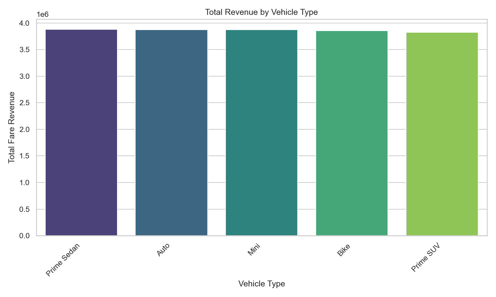
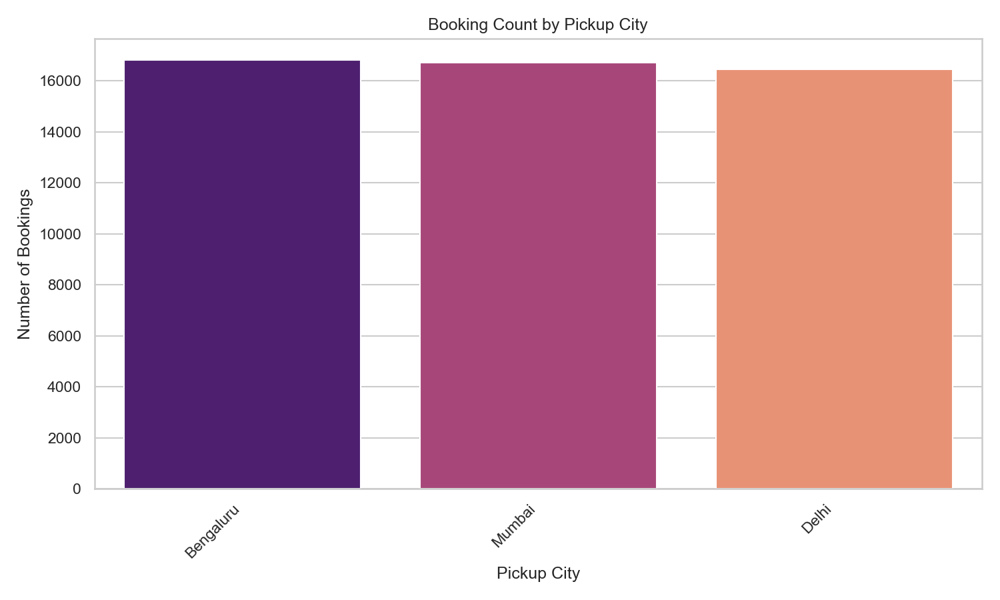
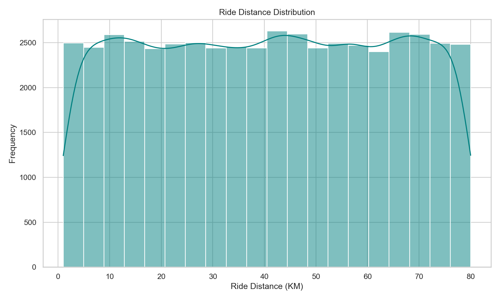
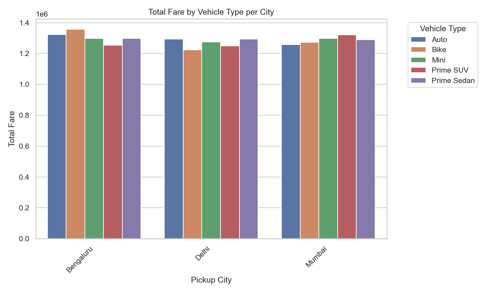
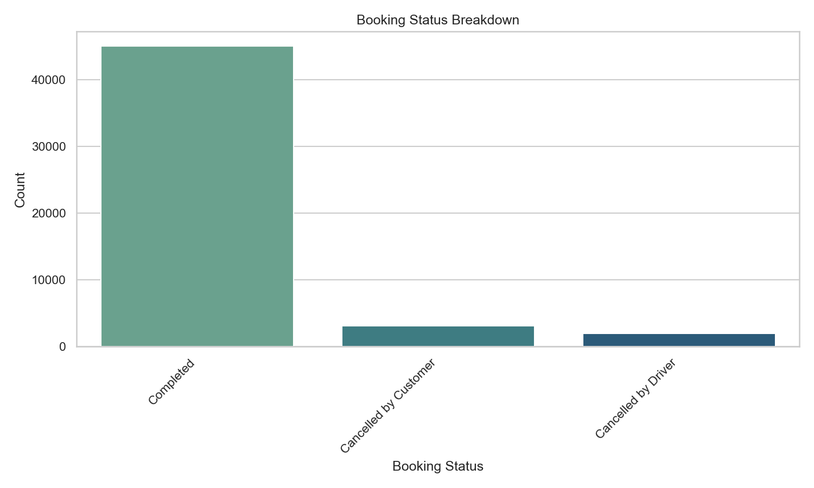

# 🚕 Ola Ride Booking Dashboard
[](#)
[](#)
[](#)

A Python + MySQL project for managing, analyzing, and visualizing Ola ride booking data. The project provides a full CRUD console application backed by MySQL, along with Seaborn-powered chart visualizations for ride and revenue insights.

## 📁 Project Files

- [`ola_ride_booking.py`](./ola_ride_booking.py) — Main Python application: database table management, CRUD operations, CSV export, and chart visualization
- [`ola_ride_booking.sql`](./ola_ride_booking.sql) — SQL dump/schema for the `ola_ride_booking_50000` table

## 🚀 Features

- **Table Structure Management** — Create, alter, and manage the `ola_ride_booking_50000` table
- **CRUD Operations** — Add, update, delete, and view ride booking records
- **CSV Export** — Export all booking records to a CSV file
- **Data Visualization** — Generate Seaborn charts directly from the MySQL database:
  - Total Revenue by Vehicle Type
  - Booking Count by Pickup City
  - Ride Distance Distribution
  - Total Fare by Vehicle Type per City
  - Booking Status Breakdown

## 🛠️ Tech Stack

- Python (`mysql-connector-python`, `pandas`, `matplotlib`, `seaborn`)
- MySQL

## 📊 Dashboard Visualizations

### Total Revenue by Vehicle Type


### Booking Count by Pickup City


### Ride Distance Distribution


### Total Fare by Vehicle Type per City


### Booking Status Breakdown


## ⚙️ Setup & Usage

1. Clone the repository:
   ```bash
   git clone https://github.com/<your-username>/ola_ride_booking.git
   cd ola_ride_booking
   ```

2. Install dependencies:
   ```bash
   pip install mysql-connector-python pandas matplotlib seaborn
   ```

3. Set up the MySQL database using the provided schema/dump:
   ```bash
   mysql -u root -p < ola_ride_booking.sql
   ```

4. Update the `DB_CONFIG` dictionary in `ola_ride_booking.py` with your own MySQL credentials.

5. Run the application:
   ```bash
   python ola_ride_booking.py
   ```

6. Use the interactive console menu to add/update/delete bookings, export data, or generate charts:
   ```
   1. Add New Ride Booking
   2. Update Booking Status
   3. Delete Ride Booking
   4. View All Bookings (SELECT *)
   5. Export Database Rows to CSV File
   6. Generate Chart Visualisation (Seaborn)
   7. Exit Terminal Application
   ```

## 📂 Repository Structure

```
ola_ride_booking/
├── ola_ride_booking.py
├── ola_ride_booking.sql
├── images/
│   ├── chart_revenue_by_vehicle_type.png
│   ├── chart_bookings_by_city.png
│   ├── chart_ride_distance_distribution.png
│   ├── chart_fare_by_vehicle_per_city.png
│   └── chart_booking_status_breakdown.png
└── README.md
```

## 📜 License

This project is open source and available under the MIT License.

---

## 👤 Author

**DIYA_NEGI**
📧 mailto://diyanegi875@gmail.com
🔗 [LinkedIn](https://www.linkedin.com/in/diya-negi-4a0a4a347) | [GitHub](https://github.com/diyanegi976)

Feel free to open an issue or reach out if you have questions or suggestions!

---

⭐ **If you found this project helpful, please give it a star!**
